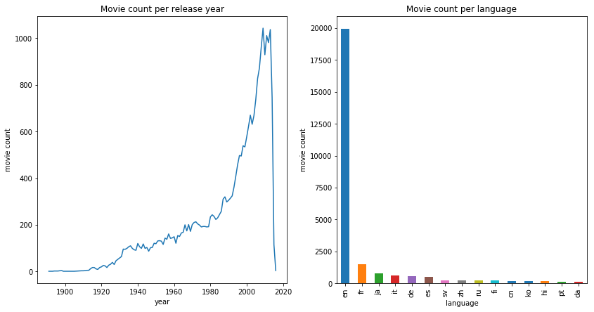
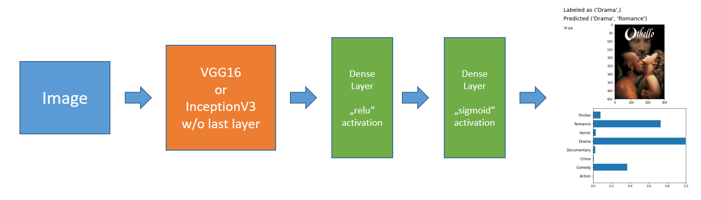
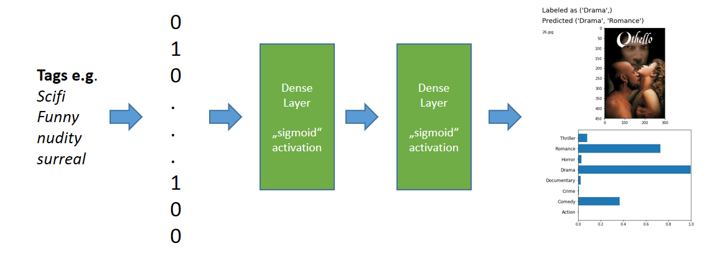
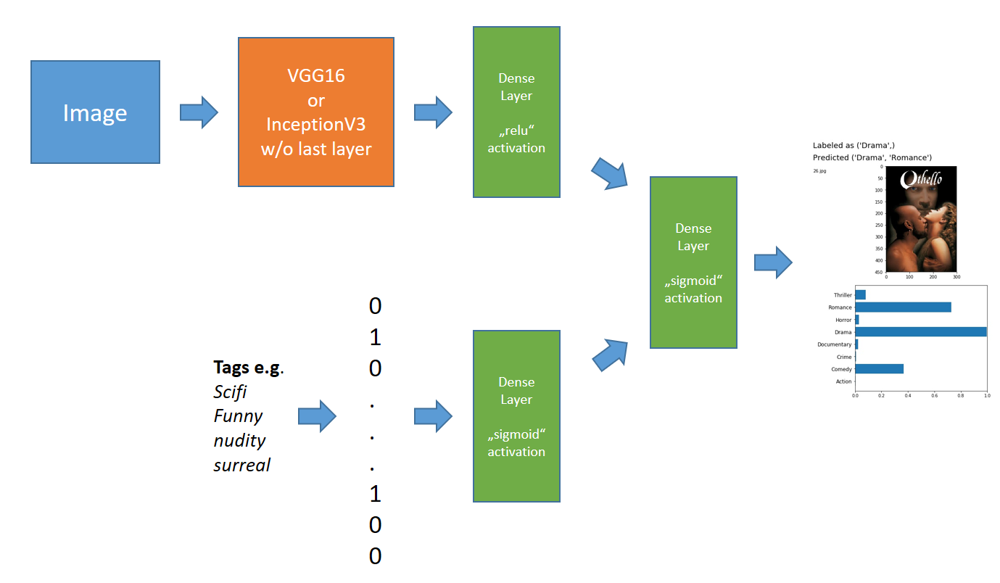
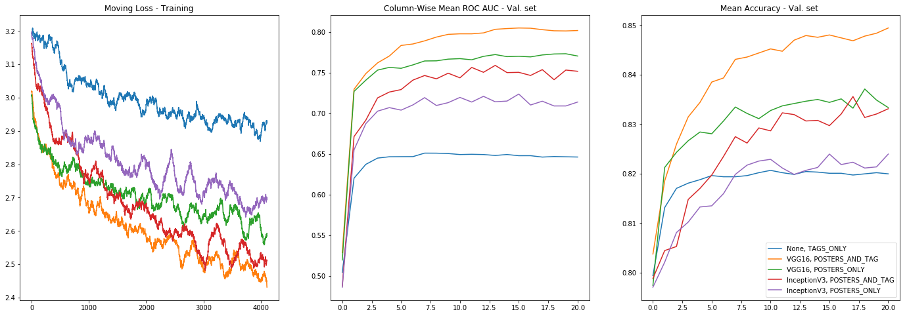
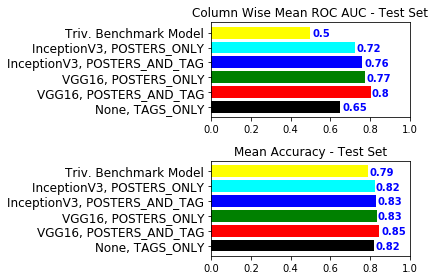

# Machine Learning Engineer Nanodegree
## Capstone Project
Boris Terentiev
December 4th, 2018

## I. Definition

### Project Overview

Machine Learning has achieved remarkable results in various domains, many of which weren't possible before with other types of algorithms, e.g. in image, text or speech recognition. These results are driven by sophisticated model architectures. The development of such models is oftentimes based on vast knowledge of the domain as well as exceptional experience in the field of machine learning. Therefore such results may be out of reach for the regular machine learning engineer and his/her niche problem. 

On the other hand the input data for many of the niche classification tasks are a combination of multiple different data types, e.g. 2D/3D images, text, raw sensory data. For some data types sophisticated classification models exist that are publicly available and can be reused easily, e.g. for image recognition there are VGG16, InceptionV3 etc.  

**One natural way to tackle these niche classification problems is to reuse the specialized models for e.g. images and text data, write custom models for data types where no specialized models exist, and subsequently combine all models into a single model by simply concatenating the results of each submodel.** 

To examine this possibility I have chosen the domain of movie genres, as there is an abundance of metadata about movies on the internet, e.g. [IMDB](https://www.imdb.com/), [TMDB](https://www.themoviedb.org/), [MovieLens](https://movielens.org/), ... .

Machine Learning is not the only possibility to solve the problem of estimating movie genres from metadata, e.g. one could create a set of heuristics that reacts to the presence of some keywords in the description of the movie. But the problem of estimating the genres can also be framed as a problem in the domain of **supervised learning** where the genres are *labels* and the movie description or the movie poster is the input. A similar example is given [here](https://towardsdatascience.com/journey-to-the-center-of-multi-label-classification-384c40229bff) where the author proposes to classify the genres from the description or movie posters.

The umbrella term for the combination of multiple learning algorithms is [Ensemble Learning](https://en.wikipedia.org/wiki/Ensemble_learning). One can see that much research effort is channeled into the development of Ensemble Learning methods just by googling the term and the instructors of [this online course](https://www.coursera.org/lecture/competitive-data-science/stacking-Qdtt6) claim that Ensembling is one major part in winning Kaggle competitions. In class we have learned about [AdaBoost](https://s3.amazonaws.com/video.udacity-data.com/topher/2017/June/593cdeca_intro-to-boosting/intro-to-boosting.pdf) in class, an instance of Ensemble Learning. Obviously there is no shortage of material to research and one could spent years by working through even the most important topics. But my personal approach to learning a new topic is to try a naïve solution first, to fail miserably and just then to start reading. This way I hope to understand better which problems are solved by the more sophisticated approaches. Consequently this project is the first step of my learning process - *try the naïve solution*.

### Problem Statement

Movies are typically categorized by people into genres, e.g. drama, comedy, thriller, etc. Each movie can fit into more than a single genre, e.g. Dramedy (Comedy and Drama) or Action-Fantasy. The problem of classifying a movie into multiple genres is called **multi label classification problem** in machine learning terms. The fact that a movie can have multiple genres means that a single data point can have *multiple labels* and *classification* is just a different word for the task of categorizing the movies into genres. 

Therefore the goal of this project to create a model that estimates the movie genres from movie metadata. I will use **movie posters** and **user-generated tags** as input data. The first step will be to create a model that works only with *movie posters* and another model that works only with *user-generated tags*. In a second step I will combine the specialized models into a single model, but without changing the architecture of the sub-models. The plan is just to concatenate the results of the sub-models and to feed them into a superstructure model.

In class we have seen how to implement your own image classification using **deep learning**. Therefore I will use deep learning to create both sub-models and also to combine the results into a new superstructure model.

### Metrics

Many different metrics exist to assess the performance of a model for *multi label classification problems*. (a subset of possible metrics can be found on [wikipedia](https://en.wikipedia.org/wiki/Multi-label_classification#Statistics_and_evaluation_metrics))

In my capstone project proposal I have stated that I am going to use the *Hamming Loss* as the performance metric. The [Hamming loss](https://en.wikipedia.org/wiki/Multi-label_classification) is defined as *the fraction of the wrong labels to the total number of labels*, that is 
$$
\begin{align*}
HL = \frac{1}{|N||L|}*\sum_{i=0}^{|N|} \sum_{j=0}^{|L|} y_{i, j} \oplus z_{i, j}
\end{align*}
$$
where $N$ is the set of datapoints, $L$ is the set of labels, $y_{i, j}$ is the target and $z_{i, j}$ is the prediction for $i$ th datapoint and $j$ th label. One downside of this metric is that one has to choose a threshold to decide if a label is present, before the hamming loss can be computed. It is not obvious how this threshold should be chosen because of two reasons. First, for unbalanced datasets most machine learning algorithms tend to bias in the direction of the most probable value. That is we can't just set the threshold e.g. to 0.5 as seen in class for the dog breed classification problem. Second setting the threshold is a domain specific task, as discussed in [this](https://stats.stackexchange.com/questions/312119/classification-probability-threshold) stackoverflow thread. One possibility to evade the problem is to use a metric that is not dependent on the choice of a threshold.

The Instructor proposed to use *mean column-wise ROC-AUC* score instead. The ROC curve is created by plotting the [true positive rate](https://en.wikipedia.org/wiki/True_positive_rate) (TPR) against the [false positive rate](https://en.wikipedia.org/wiki/False_positive_rate) (FPR) for all possible thresholds for a single label. AUC is just the area below the plotted curve. *Column-wise* refers to the fact that we compute ROC-AUC for each possible label. Therefore we compute $|L|$ ROC-AUC values - one for each label. To condense these values into a single number we compute the mean.  One benefit of the *mean column-wise ROC-AUC* is that we don't need to choose a decision threshold. 

A second benefit of using ROC is that the *sklearn* implementation provides all thresholds where TPRs or FPRs change. We can use this information to choose an "optimal" threshold for each label, where I define optimal as the *threshold with the max accuracy*, that is
$$
\begin{align*}
t^{opt}_l := argmax_{t \in [0, 1]} acc(t, l)
\end{align*}
$$
where $acc(t, l)$ is the accuracy for genre $l \in L$ and decision threshold $t$. 

We can use $t^{opt}_l$ to compute accuracy for each label and use the **mean accuracy** as an additional performance metric.

Note: In an earlier version of this document I defined "optimal" as *threshold with max sum of true negative rate and true positive rate*, that is
$$
\begin{equation}
t^{opt}_l := argmax_{t \in [0, 1]} tpr(t, l) + tnr(t, l)
\label{eq:tpr}
\tag{1}
\end{equation}
$$
where $tpr(t, l)$ and $tnr(t, l)$ are the true positive and true negative rates for a threshold $t$ and $l \in L$. After creating a trivial benchmark model, I saw that the *mean accuracy* for the sophisticated model was worse than for the trivial model. The reason is that the movie counts for each genre are highly unbalanced, i.e. it is more probable that a genre is not present than otherwise. In the definition $\eqref{eq:tpr}$ $tpr$ and $tnr$ are weighted equally, but there are much less positive values than negative ones. Therefore the influence of an additional true positive is much higher than of an additional true negative. But accuracy values both changes the same way.


## II. Analysis
### Data Retrieval
As stated earlier the goal is to use *movie posters* and *user generated movie tags* to predict the movie genres. The first step is to acquire a list of movies and it's genres. I am going to use a movie dataset provided by the [MovieLens](https://grouplens.org/datasets/movielens/) project. This dataset contains **27278 movies** from various countries and release years and can be used for research purposes [^ml-ft]. 

[^ml-ft]: F. Maxwell Harper and Joseph A. Konstan. 2015. The MovieLens Datasets: History and Context. ACM Transactions on Interactive Intelligent Systems (TiiS) 5, 4, Article 19 (December 2015), 19 pages.DOI=<http://dx.doi.org/10.1145/2827872

The dataset contains 6 csv files (for more information see the ml-20/readme.txt file): 

*Relevant files for project*

- movies.csv: a list of movies with id, title, and genres
  - the *genres* field is a subset of: Action, Adventure, Animation, Children's, Comedy, Crime, Documentary, Drama, Fantasy, Film-Noir, Horror, Musical, Mystery, Romance, Sci-Fi, Thriller, War, Western, (no genres listed)
- tags.csv: a list of user generated tags with, movie id, tag, and timestamp
- links.csv: links to tmdb and imdb for each movie present in movies.csv

*Irrelevant files*

- ratings.csv: user generated movie ratings 
- genome-scores.csv, genome-tags.csv: tag relevance score for the user generated tags, computed by a machine learning model. 

Obviously the MovieLens data miss movie posters or other interesting data like language or year of release. Fortunately we can use the TMDB links present in *links.csv* to retrieve this data. This step is implemented in the *DataRetrieval.ipynb* notebook. The enriched data is cached as

- *extended_movie_data_with_local_files.csv*: movie id, title, genres, tmdb id, release year, language, a link to the cached movie poster
- *movie posters* are saved in *posters* subfolder

### Data Analysis

#### Release year and language

First let's take a look onto three movie posters with different years of release (Fig. 1), *The Great Dictator* from 1940, *Rocky 2* from 1979, and *Sharktopus vs Pteracuda* from 2014. The design techniques differ a lot: 

- *The Great Dictator* poster is, like most posters of the time, a **drawn** picture
- *Rocky 2* is a slightly altered **photograph**, 
- *Sharktopus vs Pteracuda* is the whole **photoshop** glory of our time.

**Fig. 1: ** *The Great Dictator* from 1940 (left), *Rocky 2* from 1979 (center), and *Sharktopus vs Pteracuda* from 2014 (right)

<div style="zoom:70%;text-align:center">


</div>

We can expect similar differences in styling for different countries as well, e.g. an adult targeted anime like *Akira (Japan)* could be mistaken for a children targeted cartoon in the west. To capture such differences our Deep Neural Network needs to see enough examples for each country and year. So let's take a look to the distribution of movies per release year and language (Fig 2).

**Fig 2: ** Left: Count of movies per release year in the MovieLens dataset. Right: Count of movies per language in the MovieLens dataset.



We see that our dataset is highly unbalanced for release year and language. The count of releases increases highly each year (with some stagnation for the last couple years). The most common language is English with a huge gap. 

Unbalanced datasets may be an issue for training as most classification algorithms tend to bias in the direction of most common examples. Multiple possibilities exist to handle this issue, but as our goal is not to create the best possible classifier, but rather to examine if multiple weak classifiers can be combined in a sensible way, I will avoid this issue altogether and just **drop all non-english movies and also movies created before 1995**. My hope is that this will create a somewhat simple, consistent and balanced dataset. 

#### Genres

Now let's take a look how often each movie genre occurs in the dataset (Fig 3)

**Fig. 3:** Count of occurences and distribution of each movie genre in the MovieLens dataset.

<div style="zoom:70%;text-align:center;">
<table class="dataframe" border="1" style="width:50%">
        <colgroup>
       <col span="1" style="width: 15%;">
       <col span="1" style="width: 30%;">
       <col span="1" style="width: 30%;">
    </colgroup>
  <thead>
    <tr style="text-align: right;">
      <th></th>
      <th>count</th>
      <th>distribution</th>
    </tr>
    <tr>
      <th>genre</th>
      <th></th>
      <th></th>
    </tr>
  </thead>
  <tbody>
    <tr>
      <th>Drama</th>
      <td>4809</td>
      <td>0.216115</td>
    </tr>
    <tr>
      <th>Comedy</th>
      <td>3506</td>
      <td>0.157559</td>
    </tr>
    <tr>
      <th>Thriller</th>
      <td>2204</td>
      <td>0.099047</td>
    </tr>
    <tr>
      <th>Documentary</th>
      <td>1719</td>
      <td>0.077251</td>
    </tr>
    <tr>
      <th>Action</th>
      <td>1508</td>
      <td>0.067769</td>
    </tr>
    <tr>
      <th>Romance</th>
      <td>1474</td>
      <td>0.066241</td>
    </tr>
    <tr>
      <th>Horror</th>
      <td>1162</td>
      <td>0.052220</td>
    </tr>
    <tr>
      <th>Crime</th>
      <td>1154</td>
      <td>0.051861</td>
    </tr>
    <tr>
      <th>Adventure</th>
      <td>903</td>
      <td>0.040581</td>
    </tr>
    <tr>
      <th>Sci-Fi</th>
      <td>719</td>
      <td>0.032312</td>
    </tr>
    <tr>
      <th>Children</th>
      <td>589</td>
      <td>0.026470</td>
    </tr>
    <tr>
      <th>Fantasy</th>
      <td>579</td>
      <td>0.026020</td>
    </tr>
    <tr>
      <th>Mystery</th>
      <td>573</td>
      <td>0.025750</td>
    </tr>
    <tr>
      <th>Animation</th>
      <td>466</td>
      <td>0.020942</td>
    </tr>
    <tr>
      <th>War</th>
      <td>283</td>
      <td>0.012718</td>
    </tr>
    <tr>
      <th>Musical</th>
      <td>268</td>
      <td>0.012044</td>
    </tr>
    <tr>
      <th>IMAX</th>
      <td>172</td>
      <td>0.007730</td>
    </tr>
    <tr>
      <th>Western</th>
      <td>90</td>
      <td>0.004045</td>
    </tr>
    <tr>
      <th>(no genres listed)</th>
      <td>51</td>
      <td>0.002292</td>
    </tr>
    <tr>
      <th>Film-Noir</th>
      <td>23</td>
      <td>0.001034</td>
    </tr>
  </tbody>
</table>
</div>
Some genres are almost non present in our dataset, e.g. Film Noir or Westerns. Again I will create a (somewhat) balanced dataset by **dropping all genres that take less than 5% of all occurrences**. That is I will keep only the genres in Fig. 4.

**Fig. 4:** Genres that are kept for the training step. Other genres from Fig. 3 were dropped from the dataset.

<div style="zoom:70%;text-align:center;">
<table class="dataframe" border="1" style="width:50%">
  <thead>
    <tr style="text-align: right;">
      <th></th>
      <th>count</th>
      <th>distribution</th>
    </tr>
    <tr>
      <th>genre</th>
      <th></th>
      <th></th>
    </tr>
  </thead>
  <tbody>
    <tr>
      <th>Drama</th>
      <td>4809</td>
      <td>0.274236</td>
    </tr>
    <tr>
      <th>Comedy</th>
      <td>3506</td>
      <td>0.199932</td>
    </tr>
    <tr>
      <th>Thriller</th>
      <td>2204</td>
      <td>0.125684</td>
    </tr>
    <tr>
      <th>Documentary</th>
      <td>1719</td>
      <td>0.098027</td>
    </tr>
    <tr>
      <th>Action</th>
      <td>1508</td>
      <td>0.085995</td>
    </tr>
    <tr>
      <th>Romance</th>
      <td>1474</td>
      <td>0.084056</td>
    </tr>
    <tr>
      <th>Horror</th>
      <td>1162</td>
      <td>0.066264</td>
    </tr>
    <tr>
      <th>Crime</th>
      <td>1154</td>
      <td>0.065807</td>
    </tr>
  </tbody>
</table>
</div>

#### Tags

Next, let's look to the occurrence counts of the user generated tags in the MovieLens dataset Fig 5.

**Fig 5:** Counts for the most common and most seldom tags in the MovieLens dataset.

<div style="zoom:70%;text-align:center;">
<table class="dataframe" border="1" style="width:50%">
  <thead>
    <tr style="text-align: right;">
      <th></th>
      <th>count</th>
      <th>distribution</th>
    </tr>
    <tr>
      <th>tag</th>
      <th></th>
      <th></th>
    </tr>
  </thead>
  <tbody>
    <tr>
      <th>scifi</th>
      <td>2500</td>
      <td>0.009238</td>
    </tr>
    <tr>
      <th>action</th>
      <td>2210</td>
      <td>0.008166</td>
    </tr>
    <tr>
      <th>twist ending</th>
      <td>2014</td>
      <td>0.007442</td>
    </tr>
    <tr>
      <th>comedy</th>
      <td>1945</td>
      <td>0.007187</td>
    </tr>
    <tr>
      <th>funny</th>
      <td>1748</td>
      <td>0.006459</td>
    </tr>
    <tr>
      <th>based on a book</th>
      <td>1733</td>
      <td>0.006404</td>
    </tr>
    <tr>
      <th>nudity topless</th>
      <td>1695</td>
      <td>0.006263</td>
    </tr>
    <tr>
      <th>atmospheric</th>
      <td>1536</td>
      <td>0.005676</td>
    </tr>
    <tr>
      <th>surreal</th>
      <td>1501</td>
      <td>0.005546</td>
    </tr>
    <tr>
      <th>dark comedy</th>
      <td>1361</td>
      <td>0.005029</td>
    </tr>
    <tr>
      <th>...</th>
      <td>...</td>
      <td>...</td>
    </tr>
    <tr>
      <th>guilty pleasure increadibly funny</th>
      <td>1</td>
      <td>0.000004</td>
    </tr>
    <tr>
      <th>ebay</th>
      <td>1</td>
      <td>0.000004</td>
    </tr>
    <tr>
      <th>joke</th>
      <td>1</td>
      <td>0.000004</td>
    </tr>
    <tr>
      <th>virgen</th>
      <td>1</td>
      <td>0.000004</td>
    </tr>
    <tr>
      <th>except for the dumb ending</th>
      <td>1</td>
      <td>0.000004</td>
    </tr>
    <tr>
      <th>would have given 5 stars</th>
      <td>1</td>
      <td>0.000004</td>
    </tr>
    <tr>
      <th>a good comedy</th>
      <td>1</td>
      <td>0.000004</td>
    </tr>
    <tr>
      <th>just right</th>
      <td>1</td>
      <td>0.000004</td>
    </tr>
    <tr>
      <th>not too silly</th>
      <td>1</td>
      <td>0.000004</td>
    </tr>
    <tr>
      <th>revamp</th>
      <td>1</td>
      <td>0.000004</td>
    </tr>
  </tbody>
</table>
</div>

The first thing that strikes is that some movie genres are also present as tags, e.g. comedy as the fourth element in the list. We will drop these tags.

Second some tags occur only once or just a couple times in the dataset. Our learning algorithm won't be able to generalize over these tags, therefore I will **only keep the tags that occur a couple hundred times.**

Next let's take a look at tag occurrences per movie for a couple movie examples (Fig 6).

**Fig. 6:** Some examples of tag occurences  per movie.

<div style="zoom:70%;text-align:center;">
<table class="dataframe" border="1" style="width:50%">
  <thead>
    <tr style="text-align: right;">
      <th></th>
      <th></th>
      <th>count</th>
    </tr>
    <tr>
      <th>movieId</th>
      <th>tag</th>
      <th></th>
    </tr>
  </thead>
  <tbody>
    <tr>
      <th rowspan="22" valign="top">1</th>
      <th>3d</th>
      <td>3</td>
    </tr>
    <tr>
      <th>bdvideo</th>
      <td>1</td>
    </tr>
    <tr>
      <th>cgi</th>
      <td>4</td>
    </tr>
    <tr>
      <th>classic</th>
      <td>7</td>
    </tr>
    <tr>
      <th>clever</th>
      <td>5</td>
    </tr>
    <tr>
      <th>clv</th>
      <td>1</td>
    </tr>
    <tr>
      <th>cute</th>
      <td>1</td>
    </tr>
    <tr>
      <th>disney</th>
      <td>28</td>
    </tr>
    <tr>
      <th>dvdvideo</th>
      <td>1</td>
    </tr>
    <tr>
      <th>erlends dvds</th>
      <td>1</td>
    </tr>
    <tr>
      <th>family</th>
      <td>12</td>
    </tr>
    <tr>
      <th>friendship</th>
      <td>2</td>
    </tr>
    <tr>
      <th>fun</th>
      <td>2</td>
    </tr>
    <tr>
      <th>funny</th>
      <td>18</td>
    </tr>
    <tr>
      <th>humorous</th>
      <td>11</td>
    </tr>
    <tr>
      <th>imdb top 250</th>
      <td>5</td>
    </tr>
    <tr>
      <th>pixar</th>
      <td>79</td>
    </tr>
    <tr>
      <th>story</th>
      <td>1</td>
    </tr>
    <tr>
      <th>time travel</th>
      <td>11</td>
    </tr>
    <tr>
      <th>tom hanks</th>
      <td>23</td>
    </tr>
    <tr>
      <th>watched</th>
      <td>1</td>
    </tr>
    <tr>
      <th>witty</th>
      <td>14</td>
    </tr>
    <tr>
      <th rowspan="2" valign="top">3</th>
      <th>clv</th>
      <td>1</td>
    </tr>
    <tr>
      <th>sequel</th>
      <td>2</td>
    </tr>
    <tr>
      <th rowspan="3" valign="top">4</th>
      <th>chick flick</th>
      <td>2</td>
    </tr>
    <tr>
      <th>clv</th>
      <td>1</td>
    </tr>
    <tr>
      <th>revenge</th>
      <td>1</td>
    </tr>
    <tr>
      <th rowspan="3" valign="top">5</th>
      <th>clv</th>
      <td>1</td>
    </tr>
    <tr>
      <th>family</th>
      <td>2</td>
    </tr>
    <tr>
      <th>pregnancy</th>
      <td>2</td>
    </tr>
  </tbody>
</table>
</div>

Some tags occur only once per movie. These tags could be **erroneous entries or they could be human misclassification. Again I just dropped these tags from the tag lists movie.**

The previous table hints to another general question: Which tags are really descriptive of the movie?

The MovieLens project provides an analysis for this question in form of the [Tag  Genome](http://files.grouplens.org/papers/tag_genome.pdf). The tag genome is a data structure that contains tag relevance scores for movies created by a machine learning model. Using this data to choose which tags to keep would probably yield better results in the Training step.

### Algorithms and Techniques

In the *Definition* section I have stated that the problem of estimating movie genres is a **multi label classification problem** and as stated in the *Data Analysis* section we are going to use **movie posters** and **user-generated tags** as input data. I have also stated that in the first step I am going to create two separate models, one that works only with movie posters and one that works only with tags, and in a second step I am going to combine them into a third model, that consequently gets movie posters as well as tags as input.

In class we have learned how to create your own image classification implementations applying *Deep Learning*. I will apply the same techniques as in class for the classification on movie posters. Therefore I am going to use, for the sake of simplicity, deep learning for all three models.

As **deep neural networks (DNNs)** expect *tensors* as inputs, first I have to explain how *movie posters* and *tags* can be transformed into tensors. 

Movie posters are jpeg encoded images, which are matrices and therefore tensors. Thus nothing has to be done in order to feed images into a DNN. An operation that generally makes sense is to **normalize** the values in the image matrix to values between 0 and 1. 

Tags are categorical text values and therefore they have to be mapped to tensors. One common way of working with text/categorical values is the **bag of words** technique. *Bag of words* means that the sets of tags are mapped to 0-1-vectors where 1 is set if a tag is present and 0 else.

Second I want to explain how the output of a DNN can be interpreted as a solution of the *multi label classification problem*. DNNs return tensors as output as well. If the last layer of the DNN has $|L|$ neurons (where $L$ is the set of all possible genres/labels) and the *sigmoid* activation function is applied to each neuron, then the return value of the DNN is a vector $v \in [0, 1]^{|L|}$. In this case the values can be interpreted as probabilities for the presence of a genre $g \in L$ for the input movie. By choosing a threshold for each genre/label, one can decide if a genre is present or not present for a movie. The computation of the probability vector for a single input is called **forward propagation**. 

The weights of the DNN are changed over time to return the right genres more often than not. The algorithm that describes how to change the weights is called **back propagation**. Back propagation is an efficient implementation of the **gradient descent** optimization algorithm (or related algorithms like RMSProp) on the *function set* that is covered by DNNs. As *back propagation* is *gradient descent* it is not possible to optimize most performance metrics directly, as the objective function has to be continuously differentiable. Therefore a new function, called **loss**, has to be introduced, that behaves sufficiently similar to the performance metric and that is continuously differentiable. I have chosen the **categorical cross entropy** as *loss* in my models, that is already implemented in Keras (or the backend).

Now let's take a look to the architecture of the two sub-models and their combination.

**Movie Posters Model**

The goal is to create a DNN that gets a movie poster as input and returns a probability vector for the movie genres. 

The DNN has to solve a **image classification** task. Fortunately a lot of progress was made in the field *image classification* in the last decade and we can build on this knowledge. Specifically the technique of **Transfer Learning** applied to pre-trained **ConvNets** has proven itself invaluable for cheap and simple image classification.

"Transfer learning is a machine learning technique where a model trained on one task is re-purposed on a second related task"[^tranf ] *ConvNets* or convolutional neural networks are a class of neural networks that combine convolution, pooling and fully connected layers into a deep neural network architecture. These networks architectures turned out to perform exceptionally well on image recognition tasks [^convNets]

[^tranf]: https://machinelearningmastery.com/transfer-learning-for-deep-learning/. 
[^convNets]: https://en.wikipedia.org/wiki/Convolutional_neural_network 

*Transfer Learning* is applied to *ConvNets* by replicating the first layers of the *ConvNet* as the first layers of the new network, loading weights of a pre-trained model into the replicated subnet, fix some of the loaded weights, adding own layers and then training the new network by *back propagation*. Fortunately the *Keras* framework makes it simple to perform these steps. This will be discussed in the *Implementation* section.

For this project I used pre-trained *VGG16* and *InceptionV3* network architectures. *VGG16* and *InceptionV3* are state of the art *ConvNets* that were used to win the *ImageNet* competition a couple years ago.  First I **dropped the last layer** of the original network architecture and **fixed all weights** (an alternative is to fix only a subset of the weights). Second I added **two fully connected layers** with **relu** and **sigmoid** activation functions. Fixing weights means that these are not changed during back propagation. Therefore the forward propagation through the *VGG16* or *InceptionV3** subnet (orange box in Fig. 7) can be seen as a preprocessing step. Sometimes this step is transferred into the preprocessing code and only the images after this step are used for training, the so called **bottleneck files**. I am not going to do this as I want to have the possibility to **augment** the image data. The DNN architecture is depicted in Fig. 7.

**Fig. 7:** Depiction of the movie poster image classifier.



**User-Generated Tags Model**

As stated before, the *tags* have to be encoded as a 0-1-vector first. The DNN itself is a single hidden *full connected layer* and an *output full connected layer* both with *sigmoid* activation functions. The DNN architecture is depicted in Fig. 8.

**Fig. 8:** Depiction of the *tag* based movie genre classifier.



**Combined Model**

The last model is a combination of the previous two models. That is I dropped the *output layers* of the two previous DNNs, then I **concatenated** the results of the hidden layers and fed the concatenated vector into a new *fully connected output layer* with *sigmoid* activation function. The DNN architecture is depicted in Fig 9.

**Fig. 9:** Tag and movie poster deep neural networks combined by a dense layer.



All in all I have created 5 different models that work either on Tags only, Movie Posters only or Tags and Movie Posters, where the image classification network is based on either VGG16 or InceptionV3.

### Benchmark

The goal of Ensemble Learning is to combine "multiple learning algorithms to obtain better predictive performance than could be obtained from any of the constituent learning algorithms alone"[^ensemble]. Therefore a natural choice of a benchmark model is to use the sub-models that work only on movie posters or only on user-generated tags as benchmark models, as the goal is to create a model that performs better than each sub model.

[^ensemble]: https://en.wikipedia.org/wiki/Ensemble_learning

Another possibility is to create a trivial benchmark model, that is a model that returns always the same values for every movie. The performance of such model depends on the chosen performance metric. 

ROC-AUC will always be 0.5, as ROC-AUC computes how well the model is able to distinguish between different values. The same value in any case doesn't distinguish between different data points at all. 

For mean accuracy the situation is just a little more complicated. As seen in Fig. 4, the most probable genre is *Drama* with 27.2%. Therefore it is more probable that a genre is not present than otherwise for each genre. Consequently one achieves the best accuracy if the model always predicts *genre is **not** present*.

## III. Methodology

#### Data Preprocessing

Note: a more detailed discussion can be found in the *Data Analysis* section. I performed the following preprocessing steps on the data:

- dropped all non-english movies due to imbalance in the dataset
- dropped all movies older than 1995 due to imbalance in the dataset
- dropped genres that occur less than in 5% of the movies due to imbalance in the dataset
- kept only the top 400 tags, as too few examples for the rest and therefore no generalization possible.
- dropped tags that were used only once for a movie as these are possibly a result of misclassification.

The result are 10649 data points/movies. 

#### Implementation

##### Preamble

DNNs expect tensors as input and return tensors as output. Therefore one has to map the *tag sets* to 0-1-vectors and the outputs to present genres. The sklearn framework provides the class *MultiLabelBinarizer* to simplify this step.

```python
from sklearn.preprocessing import MultiLabelBinarizer
genres_binarizer = MultiLabelBinarizer().fit(movies.relevant_genres)
tags_binarizer = MultiLabelBinarizer().fit(movies.tags)
```

As stated before, I used the *column-wise mean ROC-AUC* as my performance metric. Again the sklearn framework provides a ready-to-use implementation of this metric.

```python
from sklearn.metrics import roc_auc_score
```

As discussed in the *Metrics* section it is possible to compute an "optimal" threshold by computing the ROC curve and computing
$$
t^{opt}_l := argmax_{t \in [0, 1]} acc(t, l)
$$
The code to compute $t^{opt}_l$ for all $l \in L$ looks as follows

```python
from sklearn.metrics import roc_curve, accuracy_score

def calc_optimal_thresholds(y_true, y_predicted):
    '''
    :param y_true true labels for a movie set. 
    two dimensional 0-1 numpy array where rows are movies and columns are genres.
    value is 1 if movie has the respective genre.
    
    :param y_predicted predicted probability distributions by the model for the same dataset as in y_true.
   
    :returns: list of optimal thresholds per genre
    '''
    optimal_thresholds = []
    
    for i in range(y_true.shape[1]):
        column_true = y_true[:, i]
        column_predicted = y_predicted[:, i]
        # the roc_curve implementation returns all thresholds where tpr or fpr change
        # I will compute for each threshold what the accuracy is and choose
        # the threshold with the highest accuracy.
        fpr, tpr, thresholds = roc_curve(column_true, column_predicted)
        
        def calc_accuracy(threshold):
            genres_present = (column_predicted >= threshold).astype(int)
            return accuracy_score(column_true, genres_present)
        
        # calc accuracy for each genre
        accuracies = list(map(calc_accuracy, thresholds))
        optimal_threshold_idx = np.argmax(accuracies)
        optimal_threshold = thresholds[optimal_threshold_idx]
        optimal_thresholds.append(optimal_threshold)
        
    return optimal_thresholds
```

The thresholds can be used to compute an *accuracy* for each genre. The mean value of these accuracies is a second performance metric I used.

```python
def calc_mean_accuracy(y_true, y_predicted_values, thresholds):
    '''
    :param y_true true labels for a movie set. 
    
    :param y_predicted_values predicted probability distributions by the model for the same dataset as in y_true.
    
    :param thresholds list of thresholds per genre. If predicted value is above threshold the movie 
    is predicted be of the genre, and not otherwise
    
    :returns: mean value of the accuracy for each genre.
    '''
    y_predicted = np.zeros(y_true.shape)
    for column in range(y_true.shape[1]):
        # for each genre compute if the genre is predicted or not predicted.
        y_predicted[:, column] = (y_predicted_values[:, column] > thresholds[column]).astype(int)
    
    return np.mean([accuracy_score(y_true[:, col], y_predicted[:, col]) for col in range(y_true.shape[1])])
```

Next I am going to spilt the dataset into a training, validation and testing dataset. The training dataset will be used for training and contains 80% of the whole dataset, that were randomly chosen. The validation dataset will be used to choose the best intermediate model during training and contain 10% of the whole dataset. The test set will be as hold out data to validate the robustness of the model and contain another 10%. Again I am going to use a sklearn function to create the datasets.

```python
from sklearn.model_selection import train_test_split
X_train, X_validation = train_test_split(movies, test_size=0.1, random_state=1)
X_train, X_test = train_test_split(X_train, test_size=0.1, random_state=1)
```

##### Training

Next I have created a custom batch generator with the name **batch_generator()**. The batch size is 20 data points/movies per batch (batch size is a parameter). The batch generator randomizes the sequence of the whole dataset at the beginning and iterates in chunks of 20 data points. Each time when the next batch is requested the batch generator does the following:

- reads movie poster images from disk, rescales the image to the right size (e.g. 224x224px for VGG16)  and normalizes the image matrix to values between 0 and 1

- transforms tags to 0-1-vectors

- transforms the movie genres to 0-1-vectors to compute the performance metric easily

- saves everything in a dictionary of the form

  - ```python
    batch = {
        'images_encoded': [...], # encoded movie posters
        'image_files': [...], # file names of the movie posters
        'genres': [...], 
        'genres_encoded': [...], # multi label encodings of the genres
        'tags': [...],
        'tags_encoded': [...], # multi label encodings of the tags
    }
    ```

  - later the models will grab the right input by the name in the dictionary, i.e. *image_encoded* and *tags_encoded*

Next I have used the **Keras** framework to implement the DNN models. As mentioned above *Keras* makes it simple to load *VGG16* and *InceptionV3* by providing an API to load the network architecture and weights. This can be done by calling the following: 

```python
from keras import applications
base_model = applications.VGG16(include_top=False, weights='imagenet', input_tensor=image_input)
```

or 

```python
from keras import applications
base_model = applications.InceptionV3(include_top=False, weights='imagenet', input_tensor=image_input)
```

To create the model that works on **movie posters** I have implemented the following function:

```python
def create_image_only_model(config):
    
    # Retrieve image classification architecture, i.e. VGG16 or InceptionV3 should be used and the image width 
    # and height to be able to define the Input object
    img_classifier_architecture = config['img_classifier_architecture']
    img_width, img_height = config['img_size']
    
    # To be able to map from batch object to the input one needs a named Input object
    image_input = Input(shape=(img_width, img_height, 3) , name='images_encoded')
    
    # Load VGG16 or InceptionV3 network architecture and weights
    if img_classifier_architecture == 'VGG16':
        base_model = applications.VGG16(include_top=False, weights='imagenet', input_tensor=image_input)
    elif img_classifier_architecture == 'InceptionV3':
        base_model = applications.InceptionV3(include_top=False, weights='imagenet', input_tensor=image_input)
    else:
        raise ValueError()

    # fix weights for VGG16 or InceptionV3 networks
    for layer in base_model.layers:
        layer.trainable = False

    # create the movie poster sub network
    x = base_model.output
    x = GlobalAveragePooling2D()(x)
    x = Dense(256, activation='relu')(x)

    predictions = Dense(len(genres_binarizer.classes_), activation='sigmoid')(x)
    model = Model(inputs=[image_input], outputs=predictions)

    # define loss and optimization algorithm
    model.compile(optimizer='rmsprop', loss='categorical_crossentropy')
    
    return model
```

To create the *tag* network I implemented the following method:

```python
def create_tag_only_model(config):
    
    # To be able to map from batch object to the input one needs a named Input object
    tags_input = Input(shape=(len(tags_binarizer.classes_),), name='tags_encoded')
    
    # tag sub network
    layer = Dense(int(len(tags_binarizer.classes_)/2), activation='sigmoid')(tags_input)
    layer = Dense(len(genres_binarizer.classes_), activation='sigmoid')(layer)
    model = Model(inputs=[tags_input], outputs=layer)
    
    # define loss and optimization algorithm
    model.compile(optimizer='rmsprop', loss='categorical_crossentropy')
    
    return model
```

And the combined network is built as follows: 

```python
def create_tag_and_image_model(config):
    # Retrieve image classification architecture, i.e. VGG16 or InceptionV3 should be used and the image width 
    # and height to be able to define the Input object
    img_classifier_architecture = config['img_classifier_architecture']
    img_width, img_height = config['img_size']
    
    # To be able to map from batch object to the input one needs a named Input object
    image_input = Input(shape=(img_width, img_height, 3) , name='images_encoded')

    # Load VGG16 or InceptionV3 network architecture and weights
    if img_classifier_architecture == 'VGG16':
        base_model = applications.VGG16(include_top=False, weights='imagenet', input_tensor=image_input)
    elif img_classifier_architecture == 'InceptionV3':
        base_model = applications.InceptionV3(include_top=False, weights='imagenet', input_tensor=image_input)
    else:
        raise ValueError()     

    # fix weights for VGG16 or InceptionV3 networks
    for layer in base_model.layers:
        layer.trainable = False

    # create the movie poster sub network
    poster_layer = base_model.output
    poster_layer = GlobalAveragePooling2D()(poster_layer)
    poster_layer = Dense(256, activation='relu')(poster_layer)

    # create the tag sub network
    tags_input = Input(shape=(len(tags_binarizer.classes_),), name='tags_encoded')
    tags_layer = Dense(int(len(tags_binarizer.classes_)/2), activation='sigmoid')(tags_input)
    
    # concatenate the results of the two sub networks and add a full connected layer
    x = concatenate([poster_layer, tags_layer])
    predictions = Dense(len(genres_binarizer.classes_), activation='sigmoid')(x)
    
    model = Model(inputs=[image_input, tags_input], outputs=predictions)

    model.compile(optimizer='rmsprop', loss='categorical_crossentropy')
    
    return model
```

If taking the *image classification* architectures into account (VGG16 and InceptionV3) this results in 5 different models. The next step is to train these models and to compare the results.

### Refinement

One could distinguish the effort to improve a model by the amount of computational vs intellectual effort one puts into. 

One way to utilize computational effort is to perform a *grid search* on some set of parameters. I used this technique on the *image classification* architecture, where I tried every models with the InceptionV3 as well as VGG16 network architectures.

Another possibility is to counter-check your assumptions, e.g. by means of a benchmark model. In a previous version of this document I didn't implement a trivial benchmark model. When I finally did, I observed that the sophisticated models performed worse in terms of the *mean accuracy* metric than the the trivial model. The reason was the the optimality criteria for the genre decision threshold (see also the *Metric*s section) was flawed for this particular problem. After solving this I got the expected results for the mean accuracy metric.

A third possibility is to apply reason. In the first version of the models I used the **hamming loss** as the performance metric and set the threshold to decide whether a genre is present for a movie naively to **0.5**. The result was a very **low performance**. It turned out that as the probability for a movie to have a specific genre is quite low, i.e. the dataset for **each** genre is very unbalanced. Therefore the models tend to return a very low probability for each genre. Obviously the threshold of 0.5 was too high to distinguish reliably between a present and a non present genre. Consequently the value threshold of 0.5 decided almost never that a genre was present at all. Switching to *column-wise mean ROC-AUC* and computing "optimal" thresholds (as discussed in the metrics section) resolved the issue.

## IV. Results

### Model Evaluation and Validation
As stated in the previous section I am comparing five different models. The hope is that the models, that use Tags as well as Posters perform better than the models that are based on Tags only or Posters only. 

In Fig. 10 the training process  is depicted in form of multiple statistics. 

- the loss function (moving loss with window of 200 batches)
- evaluations of *column-wise mean ROC-AUC* every 150 batches on the validation set 
- evaluations of *mean column-wise accuracy* every 150 batches on the validation set.

The models that use posters as well as tags perform best on the validation set in terms of the ROC-AUC metric as well as on the *mean accuracy* metric and the models that apply VGG16 perform better than the models that apply InceptionV3. The first observation was to be expected. The second observation is a little surprising as InceptionV3 achieves better performance on the ImageNet dataset. 

**Fig. 10: ** (Left) the loss function (moving loss with window of 200 batches). (Center) evaluations of *column-wise mean ROC-AUC* every 150 batches on the validation set. (Right) evaluations of *mean column-wise accuracy* every 150 batches on the validation set.




Fig. 11 depicts the values of *column-wise mean ROC-AUC* and *column-wise mean accuracy* for each model on the **test set**. Following observations stand out:

- The models seem to be robust against perturbations in the data. One can see it by comparing the values of the performance metric (ROC-AUC) between the validation and test sets (Fig 10 - Center and Fig 11 - Top). The values are very similar for the same models.

- As expected the *ROC-AUC* values for the models that combine movie posters and tags are higher than the values for the models that work on only a single input. 
- As expected the *mean accuracy* values for the models that combine movie posters and tags are higher than the values for the models that work on only a single input. 
- VGG16 based models perform better than InceptionV3 based models. This is a little surprising as VGG16 performs worse on the ImageNet dataset than InceptionV3.  

**Fig. 11:** (Top) column-wise mean ROC-AUC for test set. (Bottom) column-wise mean accuracy for test set.



### Justification

In the *Benchmark* section I defined two types of benchmark models. First a model that returns constant values for every movie. Second the models that get only movie posters or only tags as inputs. 

The performances of the models on the test set are depicted in Fig. 11. The trivial benchmark model is called *Trivial Benchmark Model*. The *Trivial Benchmark Model* performs worst on both metrics: 0.5 on ROC-AUC and 0.79 for mean accuracy metric value. 

The models that work on a single input are called *InceptionV3, POSTERS_ONLY*, *VGG16, POSTERS_ONLY*, and *None, TAGS_ONLY*.  The performances for InceptionV3 as well as VGG16 lie in between the values of the *Trivial Benchmark Model* and the *POSTERS_AND_TAG* models. 

The POSTERS_AND_TAG models perform best with a ROC-AUC score of 0.76 for InceptionV3 and 0.8 for VGG16 and mean accuracy of 0.83 for InceptionV3 and 0.85 vor VGG16.

The result is statistically significant as the test set contains 10% of all movies in the dataset, or 1064 data points.

## V. Conclusion

### Free-Form Visualization

A couple impressions on the results. More can be found in the **classification_examples** folder:

<div style="zoom:50%;text-align:center">


</div>


<div style="zoom:50%;text-align:center">


</div>


### Reflection

Before starting the project I wasn't sure what improvement one can expect just by concatenating multiple, separately developed models into a single model for the problem of estimating movie genres. Intuition suggests that the results of the combined model should be at least as good as for each sub-model, but this is not guaranteed at all, as the combined model could land in a worse local optima or the training of the combined model could just be too slow. The results show that simple concatenation as combination technique is a viable path to go.

A problem that I encountered was that the retrieval and the preprocessing of the data needed much more time than I anticipated. This is a topic I have read about on the internet but it still hit me hard, as I had to spend much more time on "infrastructure" tasks than I really wanted.

### Improvement

While researching *multi label classification problems* I encountered the fact that the common loss functions don't exploit label correlations, e.g. Comedy occurs seldom together with Documentary, but Crime and Thriller is a frequent combination. There is a whole research field of harvesting the correlations between labels but this is beyond the scope of this project.

Another problem that I didn't consider is of under- and overfitting. The results in Fig 10. - Center show that some models seem to overfit as the performance starts to decrease after some training. One could probably improve the performance by applying techniques that reduce overfitting.